---
## Front matter
title: "ОТЧЕТ ПО ЛАБОРАТОРНОЙ РАБОТЕ № 2"
author: "Воинов Кирилл Викторович"

## Generic otions
lang: ru-RU
toc-title: "Содержание"

## Bibliography
bibliography: bib/cite.bib
csl: pandoc/csl/gost-r-7-0-5-2008-numeric.csl

## Pdf output format
toc: true # Table of contents
toc-depth: 2
lof: true # List of figures
fontsize: 12pt
linestretch: 1.5
papersize: a4
documentclass: scrreprt
## I18n polyglossia
polyglossia-lang:
  name: russian
  options:
	- spelling=modern
	- babelshorthands=true
polyglossia-otherlangs:
  name: english
## I18n babel
babel-lang: russian
babel-otherlangs: english
## Fonts
mainfont: PT Serif
romanfont: PT Serif
sansfont: PT Sans
monofont: PT Mono
mainfontoptions: Ligatures=TeX
romanfontoptions: Ligatures=TeX
sansfontoptions: Ligatures=TeX,Scale=MatchLowercase
monofontoptions: Scale=MatchLowercase,Scale=0.9
## Biblatex
biblatex: true
biblio-style: "gost-numeric"
biblatexoptions:
  - parentracker=true
  - backend=biber
  - hyperref=auto
  - language=auto
  - autolang=other*
  - citestyle=gost-numeric
## Pandoc-crossref LaTeX customization
figureTitle: "Рис."
tableTitle: "Таблица"
listingTitle: "Листинг"
lofTitle: "Список иллюстраций"
lotTitle: "Список таблиц"
lolTitle: "Листинги"
## Misc options
indent: true
header-includes:
  - \usepackage{indentfirst}
  - \usepackage{float} # keep figures where there are in the text
  - \floatplacement{figure}{H} # keep figures where there are in the text
---

# Цель работы

Целью работы является изучить идеологию и применение средств контроля версий. Приобрести
практические навыки по работе с системой git.

# Ход работы

1. Создаю учётную запись на сайте https://github.com/ и заполняю основные данные. (рис. @fig:001).

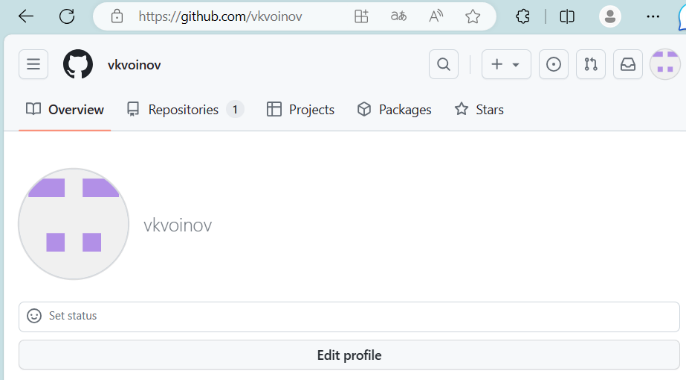{#fig:001 width=70%}

2. Делаю предварительную конфигурацию git, открыв терминал и введя следующие команды, указав
имя и email владельца репозитория. (рис. @fig:002 и рис. @fig:003).

{#fig:002 width=70%}

{#fig:003 width=70%}

3. Настраиваю utf-8 в выводе сообщений git. (рис. @fig:004).

{#fig:004 width=70%}

4. Задаю имя начальной ветки, параметр autocrlf и параметр safecrlf. (рис. @fig:005).

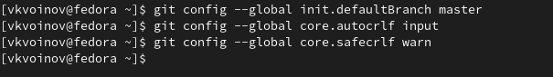{#fig:005 width=70%}

5. Генерирую ключи для последующей идентификации пользователя на сервере репозиториев. (рис. @fig:006).

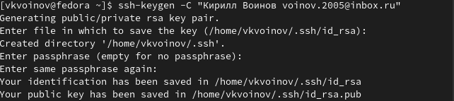{#fig:006 width=70%}

6. Копирую из локальной консоли ключ в буфер обмена(рис. @fig:007).

{#fig:007 width=70%}

7. Загружаю сгенерированный открытый ключ. (рис. @fig:008).

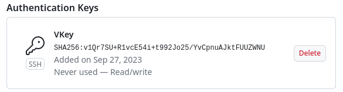{#fig:008 width=70%}

8. Создаю каталог для предмета «Архитектура компьютера». (рис. @fig:009).

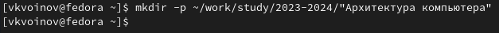{#fig:009 width=70%}

9. Перехожу в каталог курса и клонирую созданный репозиторий. (рис. @fig:010).

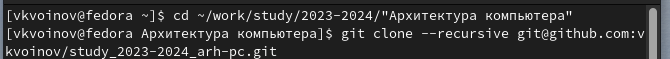{#fig:010 width=70%}

10. Удаляю лишние файлы. (рис. @fig:011).

{#fig:011 width=70%}

11. Создаю необходимые каталоги. (рис. @fig:012).

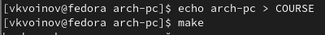{#fig:012 width=70%}

12. Отправляю файлы на сервер. (рис. @fig:013 и рис. @fig:014).

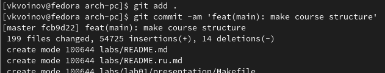{#fig:013 width=70%}

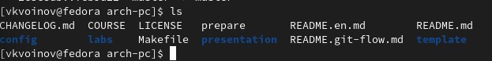{#fig:014 width=70%}

13. Проверяю правильность создания иерархии рабочего пространства в локальном репозитории и
на странице github. (рис. @fig:015 и рис. @fig:016).

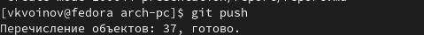{#fig:015 width=70%}

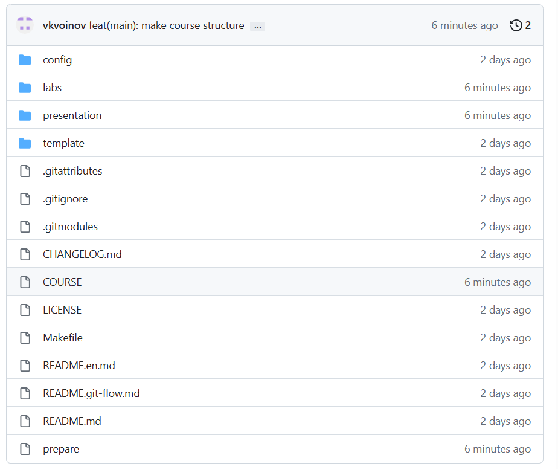{#fig:016 width=70%}

# Задания для самостоятельной работы

1. Создаю отчет по выполнению лабораторной работы в соответствующем каталоге
рабочего пространства. (рис. @fig:017).

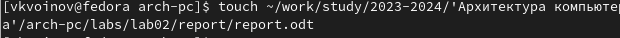{#fig:017 width=70%}

2. Копирую отчеты по выполнению предыдущих лабораторных работ в соответствующие каталоги
созданного рабочего пространства. (рис. @fig:018).

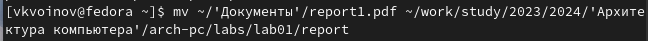{#fig:018 width=70%}

3. Загружаю файлы на github. (рис. @fig:019).

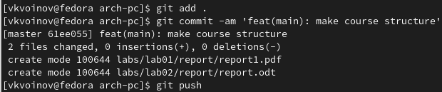{#fig:019 width=70%}

# Вывод

Выполнив эту лабораторную работу, я изучил идеологию и применение средств контроля версий,
приобрёл практические навыки по работе с системой git.

