---
## Front matter
title: "Отчёт по лабораторной работе № 3"
author: "Воинов Кирилл Викторович"

## Generic otions
lang: ru-RU
toc-title: "Содержание"

## Bibliography
bibliography: bib/cite.bib
csl: pandoc/csl/gost-r-7-0-5-2008-numeric.csl

## Pdf output format
toc: true # Table of contents
toc-depth: 2
lof: true # List of figures
fontsize: 12pt
linestretch: 1.5
papersize: a4
documentclass: scrreprt
## I18n polyglossia
polyglossia-lang:
  name: russian
  options:
	- spelling=modern
	- babelshorthands=true
polyglossia-otherlangs:
  name: english
## I18n babel
babel-lang: russian
babel-otherlangs: english
## Fonts
mainfont: PT Serif
romanfont: PT Serif
sansfont: PT Sans
monofont: PT Mono
mainfontoptions: Ligatures=TeX
romanfontoptions: Ligatures=TeX
sansfontoptions: Ligatures=TeX,Scale=MatchLowercase
monofontoptions: Scale=MatchLowercase,Scale=0.9
## Biblatex
biblatex: true
biblio-style: "gost-numeric"
biblatexoptions:
  - parentracker=true
  - backend=biber
  - hyperref=auto
  - language=auto
  - autolang=other*
  - citestyle=gost-numeric
## Pandoc-crossref LaTeX customization
figureTitle: "Рис."
tableTitle: "Таблица"
listingTitle: "Листинг"
lofTitle: "Список иллюстраций"
lotTitle: "Список таблиц"
lolTitle: "Листинги"
## Misc options
indent: true
header-includes:
  - \usepackage{indentfirst}
  - \usepackage{float} # keep figures where there are in the text
  - \floatplacement{figure}{H} # keep figures where there are in the text
---

# Цель работы

Целью работы является освоение процедуры оформления отчетов с помощью легковесного
языка разметки Markdown.

# Выполнение лабораторной работы

1. Открываю терминал (рис. @fig:001)

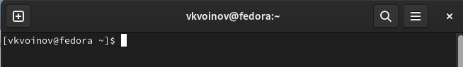{#fig:001 width=70%}

2. Перехожу в каталог курса сформированный при выполнении лабораторной работы
No2 (рис. @fig:002)

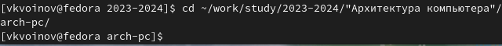{#fig:002 width=70%}

Обновляю локальный репозиторий (рис. @fig:003)

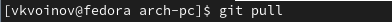{#fig:003 width=70%}

3. Перехожу в каталог с шаблоном отчета по лабораторной работе No 3 (рис. @fig:004)

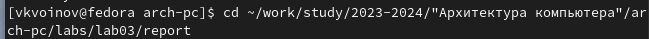{#fig:004 width=70%}

4. Провожу компиляцию шаблона с использованием Makefile (рис. @fig:005).

{#fig:005 width=70%}

Открываю файлы report.pdf и report.docx. и проверяю корректность полученных файлов (рис. @fig:006)

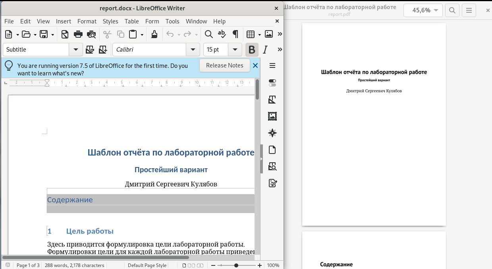{#fig:006 width=70%}

5. Удаляю полученные файлы с использованием Makefile.(рис. @fig:007).

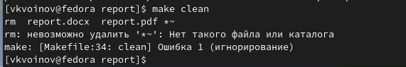{#fig:007 width=70%}

Проверяю, что после этой команды файлы report.pdf и report.docx были удалены (рис. @fig:008).

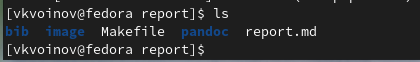{#fig:008 width=70%}

6. Открываю файл report.md c помощью gedit (рис. @fig:009).

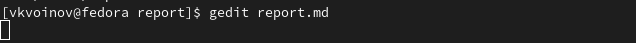{#fig:009 width=70%}

7. Заполняю отчет и компилирую его. (рис. @fig:010).

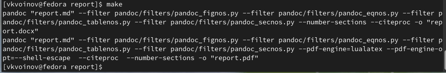{#fig:010 width=70%}

Проверяю корректность полученных файлов (рис. @fig:011).

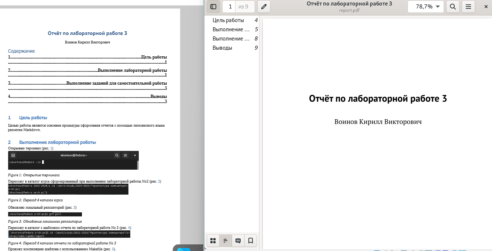{#fig:011 width=70%}

8. Загружаю файлы на Github (рис. @fig:012).

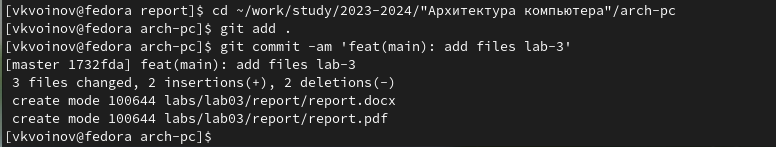{#fig:012 width=70%}

# Выполнение заданий для самостоятельной работы

1. В соответствующем каталоге делаю отчёт по лабораторной работе No 2 в формате
Markdown (рис. @fig:013)

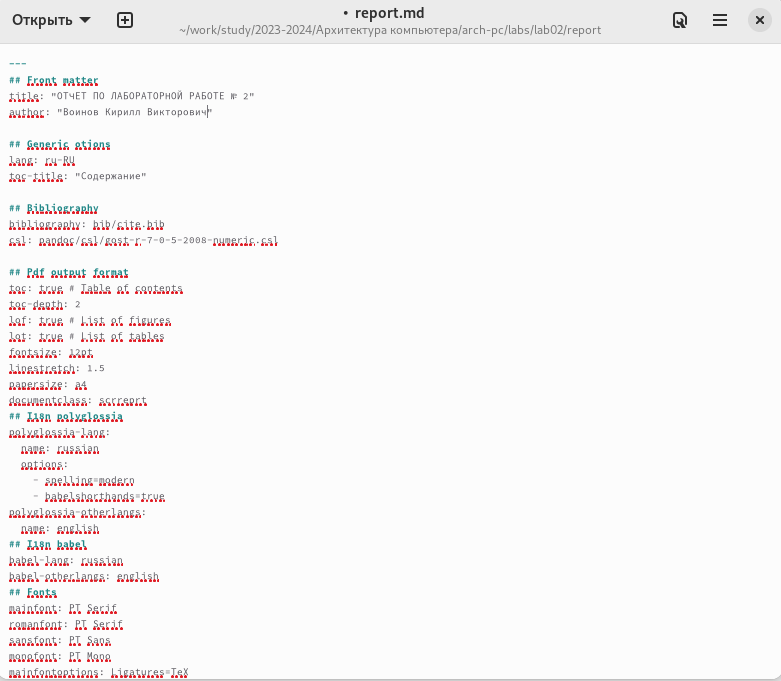{#fig:013 width=70%}

2. Загружаю файлы на github.(рис. @fig:014).

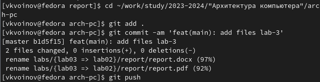{#fig:014 width=70%}

# Выводы

На этой лабораторной работе я освоил процедуры оформления отчетов с помощью легковесного
языка разметки Markdown.
