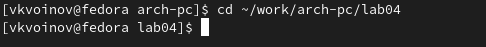
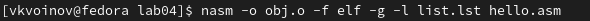

---
## Front matter
title: "Отчёт по лабораторной работе № 4"
author: "Воинов Кирилл Викторович"

## Generic otions
lang: ru-RU
toc-title: "Содержание"

## Bibliography
bibliography: bib/cite.bib
csl: pandoc/csl/gost-r-7-0-5-2008-numeric.csl

## Pdf output format
toc: true # Table of contents
toc-depth: 2
lof: true # List of figures
fontsize: 12pt
linestretch: 1.5
papersize: a4
documentclass: scrreprt
## I18n polyglossia
polyglossia-lang:
  name: russian
  options:
	- spelling=modern
	- babelshorthands=true
polyglossia-otherlangs:
  name: english
## I18n babel
babel-lang: russian
babel-otherlangs: english
## Fonts
mainfont: PT Serif
romanfont: PT Serif
sansfont: PT Sans
monofont: PT Mono
mainfontoptions: Ligatures=TeX
romanfontoptions: Ligatures=TeX
sansfontoptions: Ligatures=TeX,Scale=MatchLowercase
monofontoptions: Scale=MatchLowercase,Scale=0.9
## Biblatex
biblatex: true
biblio-style: "gost-numeric"
biblatexoptions:
  - parentracker=true
  - backend=biber
  - hyperref=auto
  - language=auto
  - autolang=other*
  - citestyle=gost-numeric
## Pandoc-crossref LaTeX customization
figureTitle: "Рис."
tableTitle: "Таблица"
listingTitle: "Листинг"
lofTitle: "Список иллюстраций"
lotTitle: "Список таблиц"
lolTitle: "Листинги"
## Misc options
indent: true
header-includes:
  - \usepackage{indentfirst}
  - \usepackage{float} # keep figures where there are in the text
  - \floatplacement{figure}{H} # keep figures where there are in the text
---

# Цель работы

Целью работы является освоение процедуры компиляции и сборки программ, написанных на ассемблере NASM.

# Выполнение лабораторной работы

1. Создаю каталог для работы с программами на языке ассемблера NASM. (рис. @fig:001)

{#fig:001 width=70%}

2. Перехожу в созданный каталог. (рис. @fig:002)

{#fig:002 width=70%}

3. Создаю текстовый файл с именем hello.asm и открываю этот файл с помощью gedit. (рис. @fig:003)

{#fig:003 width=70%}

4. Ввожу следующий текст. (рис. @fig:004)

{#fig:004 width=70%}

5. Компилирую текст в объектный код. (рис. @fig:005)

{#fig:005 width=70%}

6. С помощью команды ls проверяю, что объектный файл был создан. Объектный файл имеет имя hello.o. (рис. @fig:006)

{#fig:006 width=70%}

7. Выполняю команду nasm -o obj.o -f elf -g -l list.lst hello.asm. (рис. @fig:007)

{#fig:007 width=70%}

8. Проверяю корректность полученных файлов. (рис. @fig:008)

{#fig:008 width=70%}

9. Передаю объектный файл на обработку компоновщик (рис. @fig:009)

{#fig:009 width=70%}

10. Проверяю что файл hello был создан. (рис. @fig:010)

{#fig:010 width=70%}

11. Выполняю команду ld -m elf_i386 obj.o -o main, проверяю имя объектного файла. Имя файла - main.(рис. @fig:011)

{#fig:011 width=70%}

12. Запускаю исполняемый файл.(рис. @fig:012)

{#fig:012 width=70%}

# Выполнение заданий для самостоятельной работы

1. Создаю копию файла hello.asm с именем lab4.asm. (рис. @fig:013)

{#fig:013 width=70%}

2. Вношу изменения в текст программы в файле lab4.asm так, чтобы вместо Hello world! на экран выводилась строка с моими фамилией и именем. (рис. @fig:014)

{#fig:014 width=70%}

3. Оттранслирую полученный текст программы lab4.asm в объектный файл, выполню компоновку объектного файла и запущу получившийся исполняемый файл. (рис. @fig:015)

{#fig:015 width=70%}

4. Копирую файлы hello.asm и lab4.asm в репозиторий в каталог ~/work/study/2023-2024/"Архитектура компьютера"/arch-pc/labs/lab04/. (рис. @fig:016)

{#fig:016 width=70%}

Загружаю файлы на Github. (рис. @fig:017)

{#fig:017 width=70%}

# Выводы

На этой лабораторной работе я освоил процедуры компиляции и сборки программ, написанных на ассемблере NASM.
