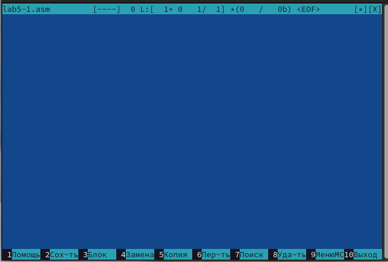
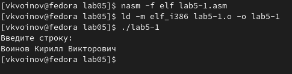

---
## Front matter
title: "Отчет по лабораторной работе №5"
author: "Воинов Кирилл"

## Generic otions
lang: ru-RU
toc-title: "Содержание"

## Bibliography
bibliography: bib/cite.bib
csl: pandoc/csl/gost-r-7-0-5-2008-numeric.csl

## Pdf output format
toc: true # Table of contents
toc-depth: 2
lof: true # List of figures
fontsize: 12pt
linestretch: 1.5
papersize: a4
documentclass: scrreprt
## I18n polyglossia
polyglossia-lang:
  name: russian
  options:
	- spelling=modern
	- babelshorthands=true
polyglossia-otherlangs:
  name: english
## I18n babel
babel-lang: russian
babel-otherlangs: english
## Fonts
mainfont: PT Serif
romanfont: PT Serif
sansfont: PT Sans
monofont: PT Mono
mainfontoptions: Ligatures=TeX
romanfontoptions: Ligatures=TeX
sansfontoptions: Ligatures=TeX,Scale=MatchLowercase
monofontoptions: Scale=MatchLowercase,Scale=0.9
## Biblatex
biblatex: true
biblio-style: "gost-numeric"
biblatexoptions:
  - parentracker=true
  - backend=biber
  - hyperref=auto
  - language=auto
  - autolang=other*
  - citestyle=gost-numeric
## Pandoc-crossref LaTeX customization
figureTitle: "Рис."
tableTitle: "Таблица"
listingTitle: "Листинг"
lofTitle: "Список иллюстраций"
lotTitle: "Список таблиц"
lolTitle: "Листинги"
## Misc options
indent: true
header-includes:
  - \usepackage{indentfirst}
  - \usepackage{float} # keep figures where there are in the text
  - \floatplacement{figure}{H} # keep figures where there are in the text
---

# Цель работы

Приобретение практических навыков работы в Midnight Commander. Освоение инструкций языка ассемблера mov и int.

# Выполнение лабораторной работы

1. Открываю Midnight Commander.(рис. @fig:001).

{#fig:001 width=70%}

2. Перехожу в каталог ~/work/arch-pc созданный при выполнении лабораторной работы No4.(рис. @fig:002).

{#fig:002 width=70%}

3. С помощью функциональной клавиши F7 создаю папку lab05 и перехожу в созданный каталог.(рис. @fig:003) и (рис. @fig:004)

{#fig:003 width=70%}

4. Пользуясь строкой ввода и командой touch создаю файл lab5-1.asm.(рис. @fig:004)

{#fig:004 width=70%}

5. С помощью функциональной клавиши F4 открываю файл lab5-1.asm для редактирования во встроенном редакторе. (рис. @fig:005)

{#fig:005 width=70%}

6. Ввожу текст программы из листинга 5.1, сохраняю изменения и закрываю файл.(рис. @fig:006) и  (рис. @fig:007)

7. С помощью функциональной клавиши F3 открываю файл lab5-1.asm для просмотра. Убеждаюсь, что файл содержит текст программы. (рис. @fig:006) и  (рис. @fig:007)

{#fig:006 width=70%}

{#fig:007 width=70%}

8. Оттранслирую текст программы lab5-1.asm в объектный файл. Выполню компоновку объектного файла и запускаю получившийся исполняемый файл. (рис. @fig:008)

{#fig:008 width=70%}

9. Скачиваю файл in_out.asm со страницы курса в ТУИС.(рис. @fig:009)

{#fig:009 width=70%}

10. Копирую файл in_out.asm в тот же каталог, что и файл с программой, в которой он используется.(рис. @fig:010)

{#fig:010 width=70%}

11. С помощью функциональной клавиши F6 создаю копию файла lab5-1.asm с именем lab5-2.asm. Выделяю файл lab5-1.asm, нажимаю клавишу F6, ввожу имя файла lab5-2.asm и нажимаю клавишу Enter.(рис. @fig:011)

{#fig:011 width=70%}

12. Исправляю текст программы в файле lab5-2.asm с использование подпрограмм из внешнего файла in_out.asm в соответствии с листингом 5.2. Создаю исполняемый файл и проверяю его работу.(рис. @fig:012) и (рис. @fig:013)

{#fig:012 width=70%}

{#fig:013 width=70%}

13. В файле lab5-2.asm заменяю подпрограмму sprintLF на sprint. Создаю исполняемый файл и проверяю его работу. Разница в том, что sprintLF работает аналогично sprint, но при выводе на экран добавляет к сообщению символ перевода строки. То есть в первом случае ввод происходил на следующей строке после 'Введите строку:' а во втором - на этой же строке.(рис. @fig:014)

{#fig:014 width=70%}

# Задание для самостоятельной работы

1. Создаю копию файла lab5-1.asm с названием lab5-1_1.asm. Вношу изменения в программу.(рис. @fig:015)

{#fig:015 width=70%}

2. Получаю исполняемый файл и проверяю его работу. На приглашение ввожу свою фамилию.(рис. @fig:016)

{#fig:016 width=70%}

3. Создаю копию файла lab5-2.asm. Исправляю текст программы с использование подпрограмм из внешнего файла in_out.asm.(рис. @fig:017)

{#fig:017 width=70%}

4. Создаю исполняемый файл и проверяю его работу.(рис. @fig:018)

{#fig:018 width=70%}

# Выводы

На этой лабораторной работе я приобрел практические навыки работы в Midnight Commander, освоил инструкции языка ассемблера mov и int.

