---
## Front matter
title: "Лабораторная работа №6"
author: "Воинов Кирилл Викторович"

## Generic otions
lang: ru-RU
toc-title: "Содержание"

## Bibliography
bibliography: bib/cite.bib
csl: pandoc/csl/gost-r-7-0-5-2008-numeric.csl

## Pdf output format
toc: true # Table of contents
toc-depth: 2
lof: true # List of figures
fontsize: 12pt
linestretch: 1.5
papersize: a4
documentclass: scrreprt
## I18n polyglossia
polyglossia-lang:
  name: russian
  options:
	- spelling=modern
	- babelshorthands=true
polyglossia-otherlangs:
  name: english
## I18n babel
babel-lang: russian
babel-otherlangs: english
## Fonts
mainfont: PT Serif
romanfont: PT Serif
sansfont: PT Sans
monofont: PT Mono
mainfontoptions: Ligatures=TeX
romanfontoptions: Ligatures=TeX
sansfontoptions: Ligatures=TeX,Scale=MatchLowercase
monofontoptions: Scale=MatchLowercase,Scale=0.9
## Biblatex
biblatex: true
biblio-style: "gost-numeric"
biblatexoptions:
  - parentracker=true
  - backend=biber
  - hyperref=auto
  - language=auto
  - autolang=other*
  - citestyle=gost-numeric
## Pandoc-crossref LaTeX customization
figureTitle: "Рис."
tableTitle: "Таблица"
listingTitle: "Листинг"
lofTitle: "Список иллюстраций"
lotTitle: "Список таблиц"
lolTitle: "Листинги"
## Misc options
indent: true
header-includes:
  - \usepackage{indentfirst}
  - \usepackage{float} # keep figures where there are in the text
  - \floatplacement{figure}{H} # keep figures where there are in the text
---

# Цель работы

Освоение арифметических инструкций языка ассемблера NASM.

# Выполнение лабораторной работы

1. Создаю каталог для программ лабораторной работы №6, перехожу в него и создаю файл lab6-1.asm. (рис. @fig:001)

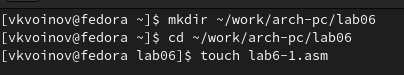{#fig:001 width=70%}

2. Ввожу в файл lab6-1.asm текст программы из листинга 6.1, создаю исполняемый файл и запускаю его.(рис. @fig:002) и (рис. @fig:003)

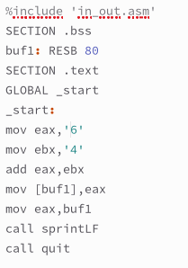{#fig:002 width=40%}

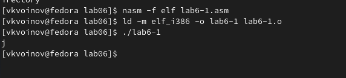{#fig:003 width=70%}

3. Изменим текст программы и вместо символов, записываю в регистры числа.(рис. @fig:004)

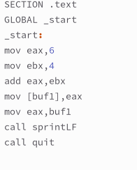{#fig:004 width=40%}

Создаю исполняемый файл и запускаю его.(рис. @fig:005)

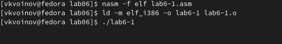{#fig:005 width=70%}

Этот код соответствует символу STX. Он не отображается на экран.

4. Создаю файл lab6-2.asm в каталоге ~/work/arch-pc/lab06 и ввожу в него текст программы из листинга 6.2. (рис.@fig:006) и (рис. @fig:007)

{#fig:006 width=70%}

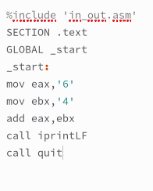{#fig:007 width=40%}

Создаю исполняемый файл и запускаю его. (рис. @fig:008)

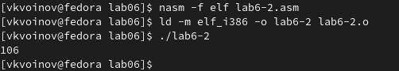{#fig:008 width=70%}

5. Аналогично предыдущему примеру изменяю символы на числа.(рис. @fig:009)

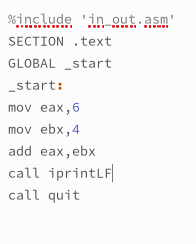{#fig:009 width=40%}

Создаю исполняемый файл и запускаю его.(рис. @fig:010)

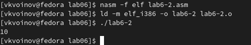{#fig:010 width=70%}

Заменяю функцию iprintLF на iprint. Создаю исполняемый файл и запускаю его.(рис. @fig:011)

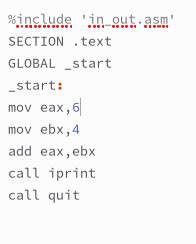{#fig:011 width=40%}

Вывод функций iprintLF и iprint отличается тем, что в первом случае после вывода происходит переход на новую строку, а во втором нет. 

6. Создаю файл lab6-3.asm в каталоге ~/work/arch-pc/lab06.(рис. @fig:012)

{#fig:012 width=70%}

Ввожу в него текст программы из листинга 6.3, создаю исполняемый файл и запускаю его.(рис. @fig:013)

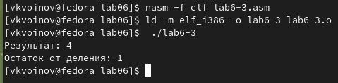{#fig:013 width=70%}

Изменяю текст программы для вычисления выражения f(x)=(4*6+2)/5. (рис. @fig:014)

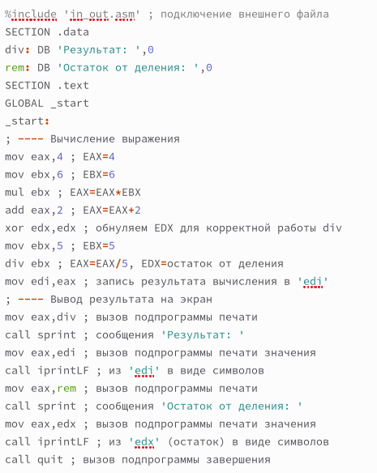{#fig:014 width=70%}

Создаю исполняемый файл и проверяю его работу. (рис. @fig:015)

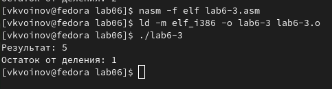{#fig:015 width=70%}

7. Создаю файл variant.asm в каталоге ~/work/arch-pc/lab06. (рис. @fig:016)

{#fig:016 width=70%}

Ввожу в него текст программы из листинга 6.3, создаю исполняемый файл и запускаю его.(рис. @fig:017)

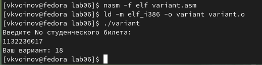{#fig:017 width=70%}

Остаток деления 1132236017 на 20 это 17 и 17+1=18.

# Ответы на вопросы
1. Какие строки листинга 6.4 отвечают за вывод на экран сообщения ‘Ваш вариант:’?
Строки:
rem: DB 'Ваш вариант: ',0 
и
mov eax,rem
call sprint

2. Для чего используется следующие инструкции?
mov ecx, x
mov edx, 80
call sread

Для ввода значения с длинной 80, передачи этого значения в x.

3. Для чего используется инструкция “call atoi”?
Для преобразования ASCII кода в число.

4. Какие строки листинга 6.4 отвечают за вычисления варианта?
Строки:
mov ebx,20
div ebx
inc edx

5. В какой регистр записывается остаток от деления при выполнении инструкции “div ebx”?
В регистр edx.

6. Для чего используется инструкция “inc edx”?
Для прибавления единицы.

7. Какие строки листинга 6.4 отвечают за вывод на экран результата вычислений?
Строки:
mov eax,edx
call iprintLF

# Задание для самостоятельной работы

1. Пишу программу вычисления выражения y=f(x). Вариант 18: f(x)=3(x+10)-20.(рис. @fig:018)

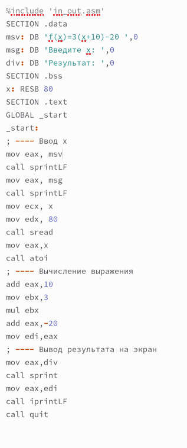{#fig:018 width=70%}

Создаю исполняемый файл и проверяю его работу для значений x1=1 и x2=5 из таблицы 6.3.(рис. @fig:019)

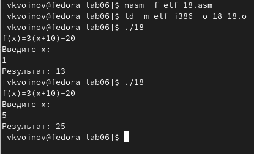{#fig:019 width=70%}

Программа вывела выражение для вычисления, вывела запрос на ввод значения x, вычислила заданное выражение в зависимости от введенного x, вывела результат вычислений. 

# Выводы

Выполняя эту лабораторную работу я освоил арифметических инструкций языка ассемблера NASM.

