---
## Front matter
title: "Лабораторной работа №7"
author: "Воинов Кирилл Викторович"

## Generic otions
lang: ru-RU
toc-title: "Содержание"

## Bibliography
bibliography: bib/cite.bib
csl: pandoc/csl/gost-r-7-0-5-2008-numeric.csl

## Pdf output format
toc: true # Table of contents
toc-depth: 2
lof: true # List of figures
fontsize: 12pt
linestretch: 1.5
papersize: a4
documentclass: scrreprt
## I18n polyglossia
polyglossia-lang:
  name: russian
  options:
	- spelling=modern
	- babelshorthands=true
polyglossia-otherlangs:
  name: english
## I18n babel
babel-lang: russian
babel-otherlangs: english
## Fonts
mainfont: PT Serif
romanfont: PT Serif
sansfont: PT Sans
monofont: PT Mono
mainfontoptions: Ligatures=TeX
romanfontoptions: Ligatures=TeX
sansfontoptions: Ligatures=TeX,Scale=MatchLowercase
monofontoptions: Scale=MatchLowercase,Scale=0.9
## Biblatex
biblatex: true
biblio-style: "gost-numeric"
biblatexoptions:
  - parentracker=true
  - backend=biber
  - hyperref=auto
  - language=auto
  - autolang=other*
  - citestyle=gost-numeric
## Pandoc-crossref LaTeX customization
figureTitle: "Рис."
tableTitle: "Таблица"
listingTitle: "Листинг"
lofTitle: "Список иллюстраций"
lotTitle: "Список таблиц"
lolTitle: "Листинги"
## Misc options
indent: true
header-includes:
  - \usepackage{indentfirst}
  - \usepackage{float} # keep figures where there are in the text
  - \floatplacement{figure}{H} # keep figures where there are in the text
---

# Цель работы

Изучение команд условного и безусловного переходов. Приобретение навыков написания программ с использованием переходов. Знакомство с назначением и структурой файла листинга.

# Выполнение лабораторной работы

1. Создаю каталог для программам лабораторной работы No 7, перехожу в него и создаю файл lab7-1.asm. (рис. @fig:001).

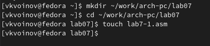{#fig:001 width=70%}

2. Ввожу в файл lab7-1.asm текст программы из листинга 7.1. (рис. @fig:002).

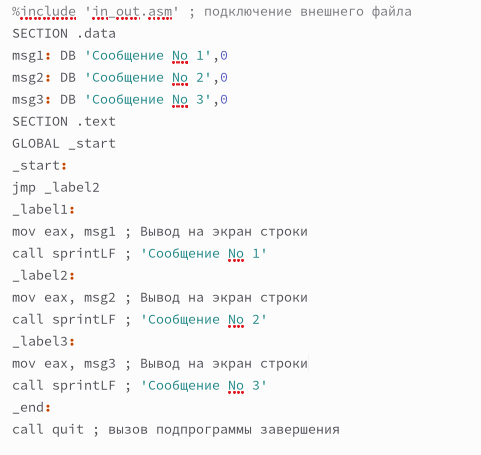{#fig:002 width=70%}

Создаю исполняемый файл и проверяю его работу. (рис. @fig:003).

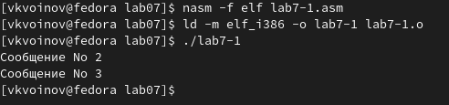{#fig:003 width=70%}

Изменяю текст программы в соответствии с листингом 7.2. (рис. @fig:004).

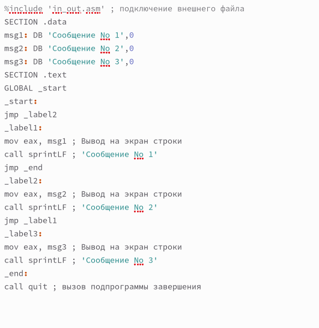{#fig:004 width=70%}

Создаю исполняемый файл и проверяю его работу. (рис. @fig:005).

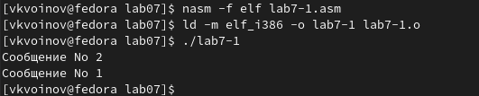{#fig:005 width=70%}

Изменяю текст программы, чтобы вывод сообщений был следующим:Сообщение No 3, Сообщение No 2, Сообщение No 1. (рис. @fig:006).

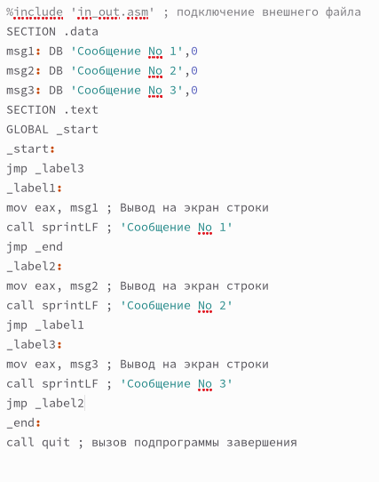{#fig:006 width=70%}

Создаю исполняемый файл и проверяю его работу. (рис. @fig:007).

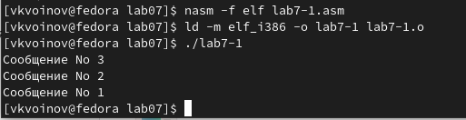{#fig:007 width=70%}

3. Создаю файл lab7-2.asm в каталоге ~/work/arch-pc/lab07. (рис. @fig:008).

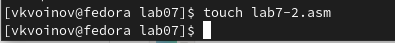{#fig:008 width=70%}

Ввожу текст программы из листинга 7.3 в lab7-2.asm. (рис. @fig:009).

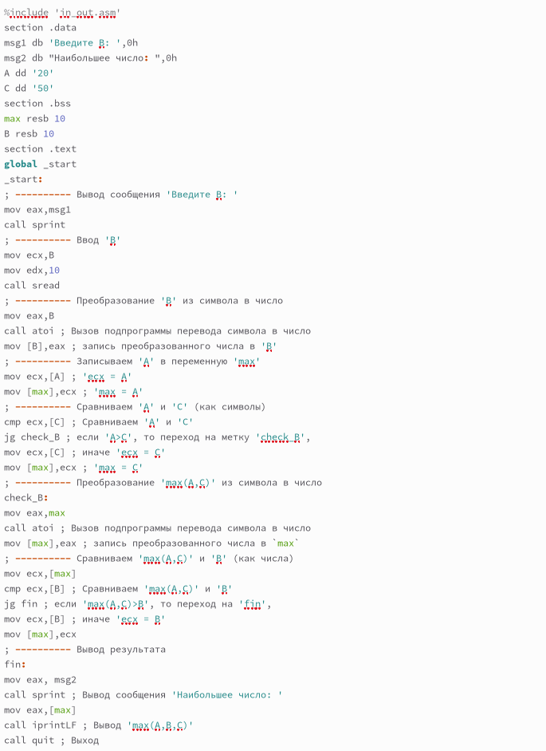{#fig:009 width=70%}

Создаю исполняемый файл и проверяю его работу для разных значений B. (рис. @fig:010) и (рис. @fig:011).

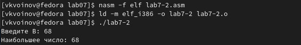{#fig:010 width=70%}

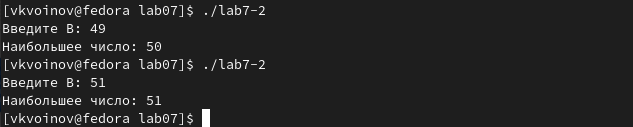{#fig:011 width=70%}

4. Создаю файл листинга для программы из файла lab7-2.asm. (рис. @fig:012).

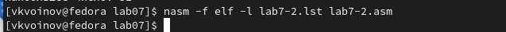{#fig:012 width=70%}

Открываю файл листинга lab7-2.lst с помощью текстового редактора mcedit. (рис. @fig:013).

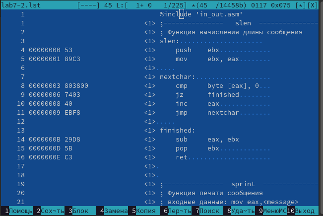{#fig:013 width=70%}

Три строки листинга(рис. @fig:014).

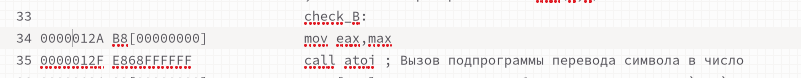{#fig:014 width=70%}

33 строка: check_B - указатель перехода в исходном тексте программы.
34 строка: 0000012A - адрес(смещение машинного кода от начала сегмента), R8[0000000] - машинный код, mov eax, max - исходный текст программы.
35 строка: 0000012F - адрес(смещение машинного кода от начала сегмента), E868FFFFFFF - машинный код, call atoi ; Вызов подпрограммы перевода символа в число - исходный текст программы

Открываю файл с программой lab7-2.asm и в одной инструкции с двумя операндами удаляю один операнд. (рис. @fig:015).

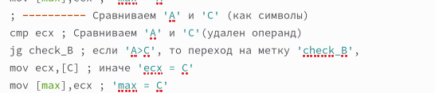{#fig:015 width=70%}

Выполняю трансляцию с получением файла листинга. (рис. @fig:016).

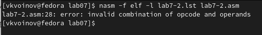{#fig:016 width=70%}

Листинг создаётся. В него добавляется уведомление об ошибке (рис. @fig:017).

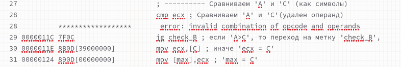{#fig:017 width=70%}

# Задание для самостоятельной работы

1. Пишу программу нахождения наименьшей из 3 целочисленных переменных a,b и c для варианта 18. (рис. @fig:018).

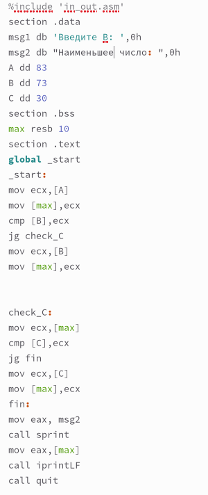{#fig:018 width=70%}

Создаю исполняемый файл и проверяю его работу. (рис. @fig:019).

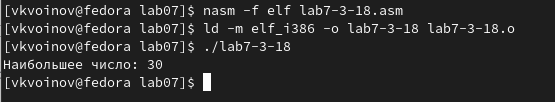{#fig:019 width=70%}

2. Пишу программу, которая для введенных с клавиатуры значений x и a вычисляет значение заданной функции f(x) и выводит результат вычислений для варианта 18. (рис. @fig:020).

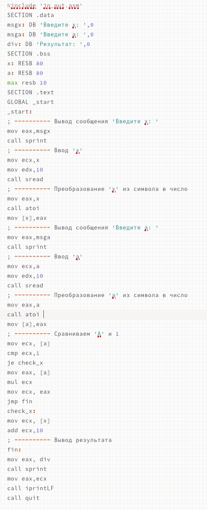{#fig:020 width=70%}

Создаю исполняемый файл и проверяю его работу для значений x и a из таблицы 7.6. (рис. @fig:021).

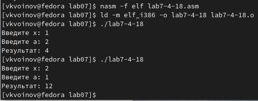{#fig:021 width=70%}

# Выводы

На этой лабораторной работе я изучил команды условного и безусловного переходов, приобрел навыки написания программ с использованием переходов и ознакомился с назначением и структурой файла листинга.
