---
## Front matter
title: "Лабораторная работа №8"
author: "Воинов Кирилл Викторович"

## Generic otions
lang: ru-RU
toc-title: "Содержание"

## Bibliography
bibliography: bib/cite.bib
csl: pandoc/csl/gost-r-7-0-5-2008-numeric.csl

## Pdf output format
toc: true # Table of contents
toc-depth: 2
lof: true # List of figures
fontsize: 12pt
linestretch: 1.5
papersize: a4
documentclass: scrreprt
## I18n polyglossia
polyglossia-lang:
  name: russian
  options:
	- spelling=modern
	- babelshorthands=true
polyglossia-otherlangs:
  name: english
## I18n babel
babel-lang: russian
babel-otherlangs: english
## Fonts
mainfont: PT Serif
romanfont: PT Serif
sansfont: PT Sans
monofont: PT Mono
mainfontoptions: Ligatures=TeX
romanfontoptions: Ligatures=TeX
sansfontoptions: Ligatures=TeX,Scale=MatchLowercase
monofontoptions: Scale=MatchLowercase,Scale=0.9
## Biblatex
biblatex: true
biblio-style: "gost-numeric"
biblatexoptions:
  - parentracker=true
  - backend=biber
  - hyperref=auto
  - language=auto
  - autolang=other*
  - citestyle=gost-numeric
## Pandoc-crossref LaTeX customization
figureTitle: "Рис."
tableTitle: "Таблица"
listingTitle: "Листинг"
lofTitle: "Список иллюстраций"
lotTitle: "Список таблиц"
lolTitle: "Листинги"
## Misc options
indent: true
header-includes:
  - \usepackage{indentfirst}
  - \usepackage{float} # keep figures where there are in the text
  - \floatplacement{figure}{H} # keep figures where there are in the text
---

# Цель работы

Приобретение навыков написания программ с использованием циклов и обработкой аргументов командной строки.

# Выполнение лабораторной работы
1. Создаю каталог для программ лабораторной работы No 8, перехожу в него и создаю файл lab8-1.asm.(рис. @fig:001)

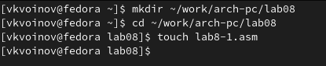{#fig:001 width=70%}

Ввожу в файл lab8-1.asm текст программы из листинга 8.1. (рис. @fig:002)

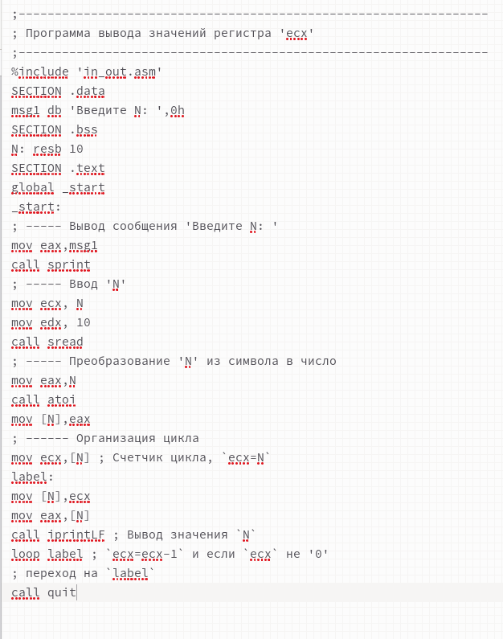{#fig:002 width=70%}

Создаю исполняемый файл и проверяю его работу.(рис. @fig:003)

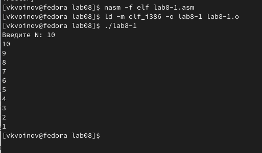{#fig:003 width=70%}

Изменяю текст программы добавив изменение значения регистра ecx в цикле.(рис. @fig:004)

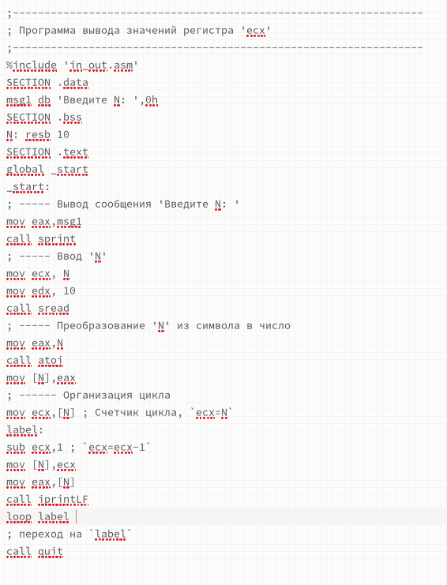{#fig:004 width=70%}

Создаю исполняемый файл и проверяю его работу.(рис. @fig:005)

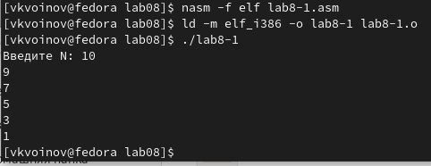{#fig:005 width=70%}

Регистр ecx принимает значения 10,9,7,5,3,1,0.
Число проходов цикла не соответствует значению N введенному с клавиатуры.

Вношу изменения в текст программы добавив команды push и pop (добавления в стек и извлечения из стека) для сохранения значения счетчика цикла loop.(рис. @fig:006)

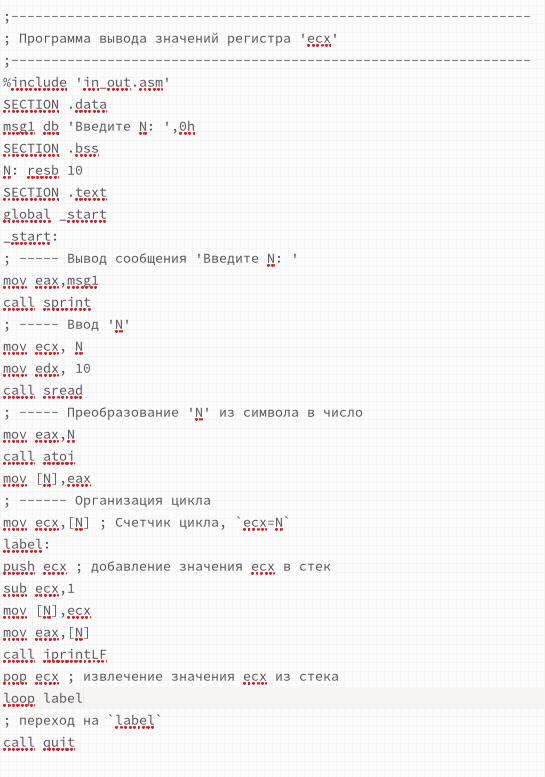{#fig:006 width=70%}

Создаю исполняемый файл и проверяю его работу.(рис. @fig:007)

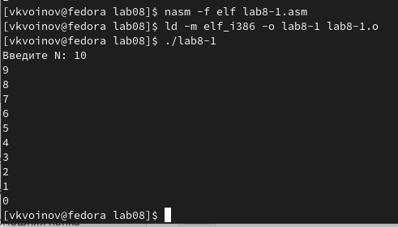{#fig:007 width=70%}

Число проходов цикла соответствует значению N введенному с клавиатуры.

2. Создаю файл lab8-2.asm в каталоге ~/work/arch-pc/lab08.(рис. @fig:008)

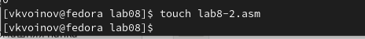{#fig:008 width=70%}

Ввожу в файл lab8-2.asm текст программы из листинга 8.2.(рис. @fig:009)

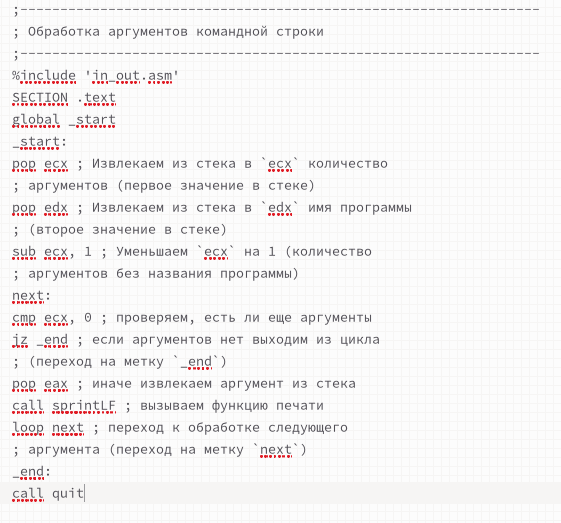{#fig:009 width=70%}

Создаю исполняемый файл и проверяю его работу, указав аргументы: аргумент1 аргумент 2 'аргумент 3'.(рис. @fig:010)

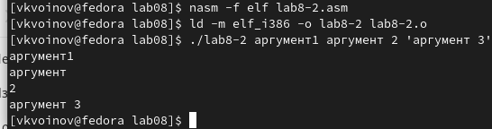{#fig:010 width=70%}

Было обработано программой 4 аргумента.

Создаю файл lab8-3.asm в каталоге ~/work/arch-pc/lab08.(рис. @fig:011)

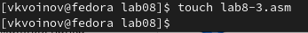{#fig:011 width=70%}

Ввожу в него текст программы из листинга 8.3.(рис. @fig:012)

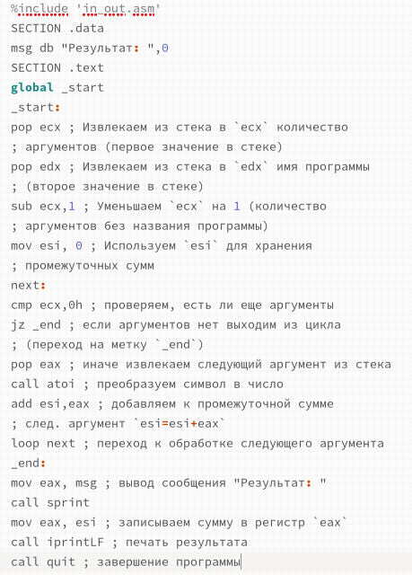{#fig:012 width=70%}

Создаю исполняемый файл и запускаю его, указав аргументы.(рис. @fig:013)

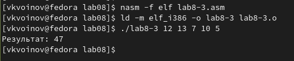{#fig:013 width=70%}

Изменяю текст программы из листинга 8.3 для вычисления произведения аргументов командной строки.(рис. @fig:014)

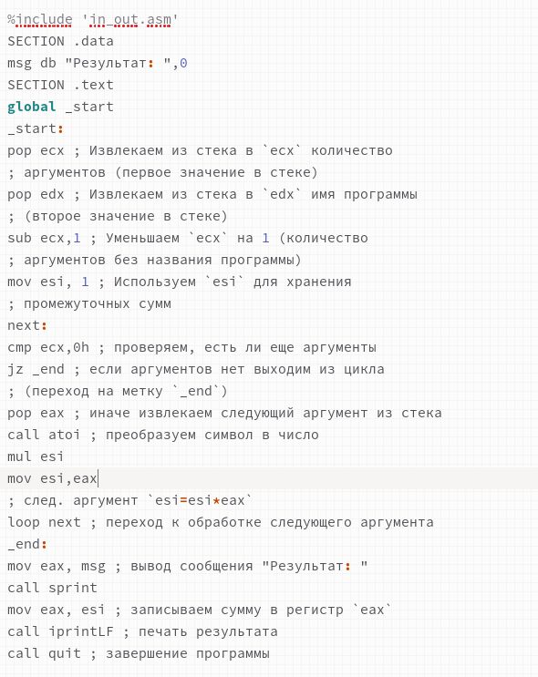{#fig:014 width=70%}

Создаю исполняемый файл и запускаю его, указав аргументы.(рис. @fig:015)

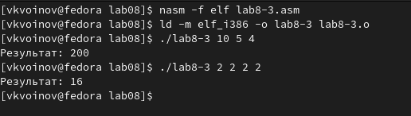{#fig:015 width=70%}

# Задание для самостоятельной работы

Пишу программу, которая находит сумму значений функции f(x) для x=x1, x2,..., xn т.е. программа выводит значение f(x1) + f(x2) +...+f(xn). Значения xi передаются как аргументы. Вариант 18: f(x)=17+5x.(рис. @fig:016)

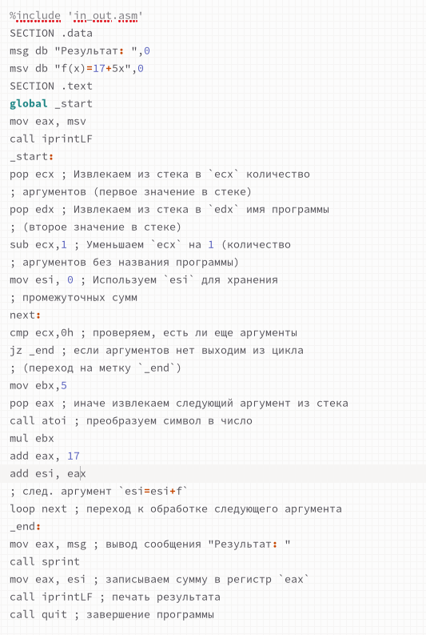{#fig:016 width=70%}

Создаю исполняемый файл и проверяю его работу на нескольких наборах x=x1, x2,..., xn.(рис. @fig:017)

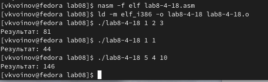{#fig:017 width=70%}

# Выводы

На этой лабораторной работе я приобрел навыки написания программ с использованием циклов и обработкой аргументов командной строки.

