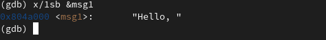
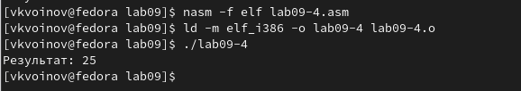

---
## Front matter
title: "Лабораторная работа №9"
author: "Воинов Кирилл Викторович"

## Generic otions
lang: ru-RU
toc-title: "Содержание"

## Bibliography
bibliography: bib/cite.bib
csl: pandoc/csl/gost-r-7-0-5-2008-numeric.csl

## Pdf output format
toc: true # Table of contents
toc-depth: 2
lof: true # List of figures
fontsize: 12pt
linestretch: 1.5
papersize: a4
documentclass: scrreprt
## I18n polyglossia
polyglossia-lang:
  name: russian
  options:
	- spelling=modern
	- babelshorthands=true
polyglossia-otherlangs:
  name: english
## I18n babel
babel-lang: russian
babel-otherlangs: english
## Fonts
mainfont: PT Serif
romanfont: PT Serif
sansfont: PT Sans
monofont: PT Mono
mainfontoptions: Ligatures=TeX
romanfontoptions: Ligatures=TeX
sansfontoptions: Ligatures=TeX,Scale=MatchLowercase
monofontoptions: Scale=MatchLowercase,Scale=0.9
## Biblatex
biblatex: true
biblio-style: "gost-numeric"
biblatexoptions:
  - parentracker=true
  - backend=biber
  - hyperref=auto
  - language=auto
  - autolang=other*
  - citestyle=gost-numeric
## Pandoc-crossref LaTeX customization
figureTitle: "Рис."
tableTitle: "Таблица"
listingTitle: "Листинг"
lofTitle: "Список иллюстраций"
lotTitle: "Список таблиц"
lolTitle: "Листинги"
## Misc options
indent: true
header-includes:
  - \usepackage{indentfirst}
  - \usepackage{float} # keep figures where there are in the text
  - \floatplacement{figure}{H} # keep figures where there are in the text
---

# Цель работы

Приобретение навыков написания программ с использованием подпрограмм. Знакомство с методами отладки при помощи GDB и его основными возможностями

# Выполнение лабораторной работы
1. Реализация подпрограмм в NASM

1) Создаю каталог для выполнения лабораторной работы No 9, перехожу в него и создаю файл lab09-1.asm.(рис. @fig:001).

{#fig:001 width=70%}

2) Ввожу в файл lab09-1.asm текст программы из листинга 9.1.(рис. @fig:002).

{#fig:002 width=70%}

Создаю исполняемый файл и проверьте его работу.(рис. @fig:003).

{#fig:003 width=70%}

Изменяю текст программы, добавив подпрограмму _subcalcul в подпрограмму _calcul, для вычисления выражения f(g(x)), где x вводится с клавиатуры, f(x) = 2x + 7, g(x) = 3x - 1. Т.е. x передается в подпрограмму _calcul из нее в подпрограмму _subcalcul, где вычисляется выражение g(x), результат возвращается в _calcul и вычисляется выражение f(g(x)). Результат возвращается в основную программу для вывода результата на экран.(рис. @fig:004) и (рис. @fig:004).

{#fig:004 width=70%}

![Работа измененной программы]](image/5.png){#fig:005 width=70%}

2. Отладка программам с помощью GDB

1) Создаю файл lab09-2.asm с текстом программы из Листинга 9.2. (Программа печати сообщения Hello world!).(рис. @fig:006) и (рис. @fig:007).

{#fig:006 width=70%}

{#fig:007 width=70%}

Получаю исполняемый файл и загружаю его в отладчик gdb.(рис. @fig:008).

{#fig:008 width=70%}

Проверяю работу программы, запустив ее в оболочке GDB с помощью команды run.(рис. @fig:009).

{#fig:009 width=70%}

Устанавливаю брейкпоинт на метку _start и запускаю программу.(рис. @fig:010).

{#fig:010 width=70%}

С помощью команды disassemble начиная с метки _start смотрю дисассимилированный код программы.(рис. @fig:011).

{#fig:011 width=70%}

Переключаюсь на отображение команд с Intel’овским синтаксисом.(рис. @fig:012).

{#fig:012 width=70%}

Различия отображения синтаксиса машинных команд в режимах ATT и Intel:
Различия присутствуют лишь конце строчек. Перед операндами и адресами в первом случае ставятся % и $ соответственно и первым стоит адрес, а во  втором таких символов нет и первым стоит адрес.(например $0x4,%eax и eax,0x4)

Включаю режим псевдографики для более удобного анализа программы.(рис. @fig:013).

{#fig:013 width=70%}

2)Проверяю наличие брейкпоинта по имени метки (_start) и устанавливаю новую по адресу предпоследней инструкции.(рис. @fig:014).

{#fig:014 width=70%}

Просматриваю информацию о всех установленных брейкпоинтах.(рис. @fig:015).

{#fig:015 width=70%}

При выполнении 5 инструкций изменяются регистры eax, ebx, ecx, edx, eax.

Смотрю значение переменной msg1.(рис. @fig:016).

{#fig:016 width=70%}

Изменяю первый символ переменной msg1.(рис. @fig:017).

{#fig:017 width=70%}

Изменяю первый символ переменной msg2.(рис. @fig:018).

{#fig:018 width=70%}

С помощью команды set изменяю значение регистра ebx.(рис. @fig:019).

{#fig:019 width=70%}

Разница возникает из за того, что в первом случае 2 читается как символ а во втором как число.

Завершаю выполнение программы и выхожу из GDB.

3) Копирую файл lab8-2.asm, созданный при выполнении лабораторной работы No8, с программой выводящей на экран аргументы командной строки (Листинг 8.2) в файл с именем lab09-3.asm. (рис. @fig:021).

{#fig:021 width=70%}

Создаю исполняемый файл.(рис. @fig:022).

{#fig:022 width=70%}

Загружаю исполняемый файл в отладчик, указав аргументы. (рис. @fig:023).

{#fig:023 width=70%}

Устанавливаю точку остановки перед первой инструкцией в программе.(рис. @fig:024).

{#fig:024 width=70%}

Запускаю программу и просматриваю позиции стека.(рис. @fig:025).

{#fig:025 width=70%}

# Задание для самостоятельной работы
1.Преобразовываю программу из лабораторной работы No8 (Задание No1 для самостоятельной работы), реализовав вычисление значения функции f(x) как подпрограмму.(рис. @fig:026) и (рис. @fig:027).

{#fig:026 width=70%}

{#fig:027 width=70%}

В листинге 9.3 приведена программа вычисления выражения (3+2)*4+5. При запуске данная программа дает неверный результат. Проверьте это. С помощью отладчика GDB, анализируя изменения значений регистров, определите ошибку и исправьте ее.(рис. @fig:029).

{#fig:028 width=70%}

С помощью отладчика я поочередно проверял каждую строку и изменение регистров и заметил, что при умножении на ecx, ebx не изменяется, а изменяется eax. (рис. @fig:029) и (рис. @fig:030).

{#fig:029 width=70%}

{#fig:030 width=70%}

Для исправления этой ошибки достаточно поменять местами ebx и eax.(рис. @fig:031) и (рис. @fig:032).

{#fig:031 width=70%}

(рис. @fig:032).

{#fig:032 width=70%}

# Выводы

На этой лабораторной работе я приобрел навыки написания программ с использованием подпрограмм, ознакомился с методами отладки при помощи GDB и его основными возможностями.

